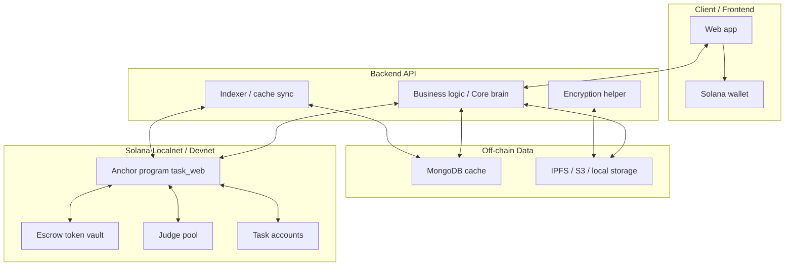
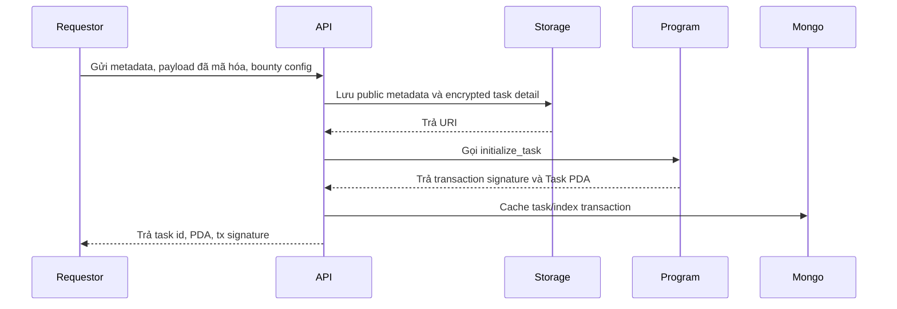
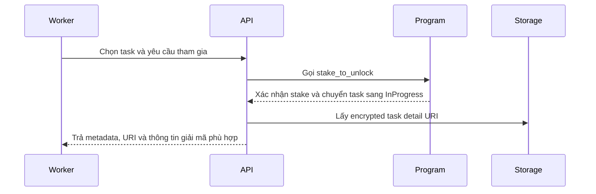
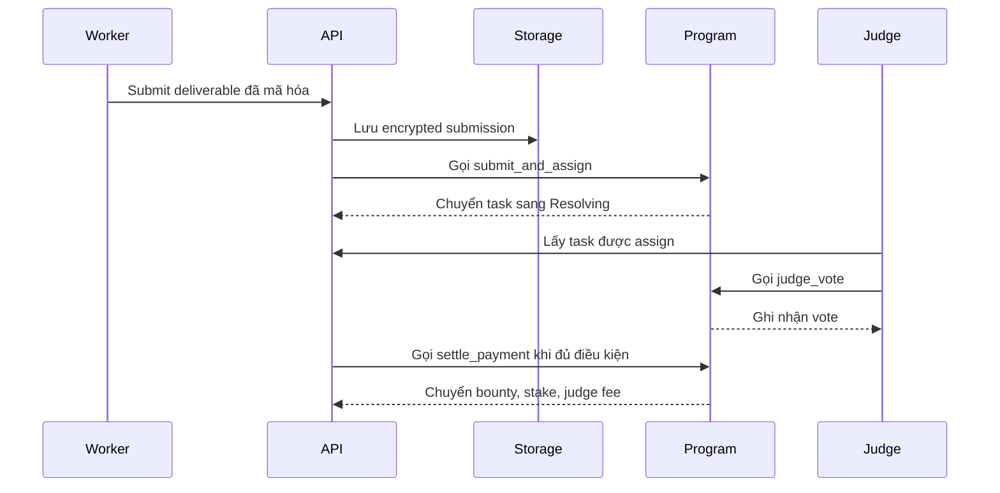

# Thiết kế kiến trúc Task

## Tổng quan hệ thống

Task là marketplace phi tập trung cho các tác vụ AI agent. Hệ thống dùng Solana làm lớp xác thực, escrow, staking, voting và quyết toán; dữ liệu off-chain như metadata, URI mã hóa và lịch sử giao dịch được lưu/cache để frontend truy vấn nhanh hơn.

Với hướng Option B, kiến trúc nên được hiểu là **hybrid first**. Smart contract hiện tại nên được xem là **trust core v1** để test end-to-end flow, không phải thiết kế cuối cùng đã đóng băng:

- Solana program viết bằng Anchor nằm trong `programs/task_web`.
- Test tích hợp Anchor/TypeScript nằm trong `tests`.
- MongoDB cache nằm trong `app/db`.
- Backend API là lớp điều phối business logic: validate request, quản lý metadata/payload, gọi Anchor client, ghi cache và trả response dễ test bằng Postman/Playwright/supertest.
- Trong giai đoạn hiện tại, chưa nên refactor smart contract vì các instruction đang đủ để chạy flow thật.
- Về dài hạn, smart contract chỉ nên giữ phần cần trust cao: escrow, stake, payment settlement, vote proof và trạng thái tối thiểu.
- Các logic mềm, dễ thay đổi như scoring nâng cao, judge selection policy, ranking, reputation và rule vận hành nên được quan sát qua Backend API trước rồi mới quyết định giữ on-chain hay chuyển off-chain.



## Đánh giá nhanh hai tài liệu gốc

Hai tài liệu gốc mô tả đúng ý tưởng sản phẩm: task được tạo, worker stake để mở khóa, worker nộp kết quả, judge bỏ phiếu, smart contract quyết toán bounty và phí judge. Đây là hướng hợp lý cho một hackathon demo vì workflow rõ, có yếu tố blockchain thật và có câu chuyện incentive dễ trình bày.

Điểm cần chỉnh để khớp project hiện tại:

- Tài liệu gốc ghi frontend là Svelte + shadcn và backend là Python/FastAPI, nhưng repo hiện tại là Anchor + TypeScript, có MongoDB cache. Nếu giữ Python/Svelte sẽ làm tài liệu lệch với code.
- Không nên gọi Solana program là "Smart Contracts" theo nghĩa Ethereum thuần; trong Solana/Anchor nên gọi là "program" hoặc "Anchor program".
- NFT không nên là yêu cầu bắt buộc cho MVP nếu program hiện tại đã có `nft_asset` nhưng lifecycle chính vẫn nằm trong `Task` account và escrow. Có thể xem NFT là lớp nhận diện/asset đại diện, không phải nguồn sự thật duy nhất.
- Encryption/key exchange cần được mô tả rõ hơn: on-chain chỉ nên lưu URI/hash/public metadata, không lưu plaintext hoặc key nhạy cảm.
- Backend không nhất thiết phải là backend thuần. Với mục tiêu test local như API backend, một API wrapper mỏng là đủ.

## Thành phần chính

### 1. Solana Anchor Program

Program `task_web` là nguồn sự thật cho các hành vi có tiền và trạng thái quan trọng:

- Khởi tạo protocol và cấu hình phí judge.
- Judge đăng ký/hủy đăng ký.
- Requestor tạo task, nạp bounty và cấu hình deadline.
- Worker stake để nhận task.
- Worker submit URI kết quả đã mã hóa.
- Judge được assign, vote pass/fail.
- Quyết toán bounty, hoàn/giữ stake, trả phí judge.
- Hủy task chưa nhận hoặc task đã quá hạn.

Các instruction hiện có:

- `admin_init_protocol`
- `judge_register`
- `judge_unregister`
- `initialize_task`
- `cancel_open_task`
- `stake_to_unlock`
- `submit_and_assign`
- `init_judge_assignment`
- `judge_vote`
- `settle_payment`
- `claim_judge_fee`
- `cancel_expired_task`

### 2. Off-chain Cache

MongoDB trong `app/db` nên được xem là cache/indexing layer:

- `tasks`: cache trạng thái task để listing/filter nhanh.
- `judges`: cache judge records.
- `judge_assignments`: cache lượt assign và vote.
- `transactions`: lịch sử giao dịch để UI hiển thị.

Nguồn sự thật vẫn là on-chain accounts. Cache có thể rebuild từ chain hoặc seed lại trong local development.

### 3. API Wrapper Tùy Chọn

Nếu mục tiêu là test giống backend API thông thường, nên thêm API wrapper mỏng:

- `POST /api/tasks`: tạo task, upload metadata, gọi `initialize_task`.
- `GET /api/tasks`: đọc MongoDB cache hoặc fetch chain.
- `POST /api/tasks/:id/stake`: gọi `stake_to_unlock`.
- `POST /api/tasks/:id/submit`: upload encrypted deliverable, gọi `submit_and_assign`.
- `POST /api/tasks/:id/vote`: gọi `judge_vote`.
- `POST /api/tasks/:id/settle`: gọi `settle_payment`.

API này giúp test bằng Postman/curl/supertest dễ hơn, nhưng không nên chứa logic quyết toán tiền thay smart contract.

### 4. Frontend

Frontend nên tập trung vào các role chính:

- Requestor: tạo task, nạp bounty, theo dõi kết quả, nhận key giải mã deliverable.
- Worker: xem marketplace, stake, lấy thông tin task, submit deliverable.
- Judge: đăng ký làm judge, nhận task được assign, vote, claim fee.
- Admin/demo: seed dữ liệu, xem trạng thái protocol, hỗ trợ demo hackathon.

### 5. Storage và Encryption

Dữ liệu lớn và dữ liệu nhạy cảm nên nằm off-chain:

- Public metadata: title, summary, reward, deadline, tiêu chí công khai.
- Encrypted task detail: yêu cầu đầy đủ, input data, rubric chi tiết.
- Encrypted submission: output của worker.

On-chain chỉ lưu URI và trạng thái xác thực. Với MVP local, có thể dùng local file storage hoặc mock IPFS; bản demo tốt hơn có thể dùng IPFS/S3.

## Data Model Đề Xuất

### Task On-chain

```text
Task {
  requestor: Pubkey
  worker: Pubkey
  id: u64
  token_mint: Pubkey
  escrow_token_vault: Pubkey
  nft_asset: Pubkey
  bounty_amount: u64
  judge_fee_bps: u16
  worker_stake_amount: u64
  created_at: i64
  submission_deadline: i64
  voting_deadline: i64
  public_metadata_uri: String
  encrypted_task_detail_uri: String
  encrypted_submission_uri: String
  required_judges_m: u16
  approval_threshold_n: u16
  pass_vote_count: u16
  fail_vote_count: u16
  assigned_judges: [Pubkey; MAX_JUDGES]
  status: TaskStatus
}
```

### Task Status

```text
Open -> InProgress -> Resolving -> Completed
Open -> Cancelled
InProgress -> Failed hoặc Cancelled khi quá hạn
Resolving -> Failed nếu không đủ điều kiện pass
```

### Indexed Task Off-chain

```text
IndexedTask {
  taskPda: string
  id: string
  requestor: string
  worker?: string
  bountyAmount: string
  workerStakeAmount: string
  publicMetadataUri: string
  encryptedTaskDetailUri: string
  encryptedSubmissionUri?: string
  status: TaskStatus
  createdAt: Date
  submissionDeadline: Date
  votingDeadline: Date
  lastSignature?: string
}
```

### Judge Assignment

```text
TaskJudgeAssignment {
  task_id: u64
  task: Pubkey
  judge: Pubkey
  assigned_order: u16
  assigned_at: i64
  has_voted: bool
  vote_is_pass: bool
  has_claimed_fee: bool
  fee_amount: u64
}
```

## Workflow Chính

### Tạo task



### Worker stake và mở khóa task



### Submit, judge và settle



## Chiến lược Test Local

### Không cần backend thuần để test smart contract

Với logic tiền, staking, voting và state transition, test tốt nhất vẫn là Anchor test:

```bash
anchor test
```

Test này nên kiểm tra:

- Tạo task thành công.
- Worker stake đúng amount.
- Worker không thể submit khi chưa stake.
- Judge vote đúng điều kiện.
- Settle trả bounty và fee đúng.
- Cancel task theo đúng trạng thái/deadline.

### Cần API wrapper nếu muốn test giống REST backend

Nếu muốn test như backend thường, thêm API wrapper và test bằng HTTP:

```bash
POST /api/tasks
POST /api/tasks/:id/stake
POST /api/tasks/:id/submit
POST /api/tasks/:id/vote
POST /api/tasks/:id/settle
```

Mỗi endpoint nên trả:

- `success`
- `signature`
- `taskPda`
- `status`
- `errorCode` nếu fail

Điểm khác backend truyền thống là các request ghi dữ liệu on-chain luôn gắn với transaction, signer và confirmation.

## Docker Compose Đề Xuất

```yaml
services:
  mongo:
    image: mongo:7
    ports:
      - "27017:27017"
    volumes:
      - mongo_data:/data/db

  solana:
    image: solanalabs/solana:latest
    ports:
      - "8899:8899"
    command: solana-test-validator --reset

  api:
    build: ./app
    ports:
      - "3001:3001"
    environment:
      - MONGODB_URI=mongodb://mongo:27017/task_web
      - SOLANA_RPC_URL=http://solana:8899
    depends_on:
      - mongo
      - solana

volumes:
  mongo_data:
```

## Chiến lược phát triển theo giai đoạn

### Phase 1: Giữ smart contract hiện tại và build API

Không sửa smart contract ngay. Tập trung xây Backend API, DB, storage và indexer để chạy full flow:

- API nhận request theo kiểu Web2.
- API upload metadata/payload.
- API gọi Anchor instruction hiện có.
- API ghi MongoDB cache.
- Indexer sync chain về DB để kiểm tra cache.

Mục tiêu của phase này là chứng minh hệ thống chạy được end-to-end và có thể test local giống backend thông thường.

### Phase 2: Quan sát friction thật

Sau khi có API và demo flow, đánh giá:

- Logic nào thay đổi nhiều khi làm sản phẩm.
- Logic nào làm smart contract phức tạp không cần thiết.
- Logic nào khó debug khi nằm on-chain.
- Logic nào buộc phải trustless vì liên quan tiền, stake, vote proof hoặc settlement.

### Phase 3: Refactor đúng ranh giới

Chỉ refactor smart contract sau khi đã thấy rõ ranh giới:

- Giữ on-chain: escrow, stake, settlement, proof quan trọng.
- Chuyển về Backend API: policy mềm, scoring/ranking nâng cao, judge selection linh hoạt, notification, metadata và operational rules.

Điểm quan trọng: **không refactor smart contract ngay, nhưng cũng không mặc định nó là final architecture**.

## Kết luận kiến trúc

Kiến trúc phù hợp nhất cho project hiện tại là:

- Smart contract/Anchor program hiện tại làm trust core v1 để validate flow.
- MongoDB làm cache/indexing off-chain.
- Backend API làm core brain cho business workflow, hỗ trợ frontend và test local theo phong cách backend API.
- Frontend gọi API wrapper trong demo, nhưng các kiểm chứng quan trọng vẫn nên nằm ở Anchor tests.

Cách này giúp dự án vừa giữ được tính phi tập trung ở phần tiền và trạng thái quan trọng, vừa dễ demo, dễ test và dễ mở rộng.
